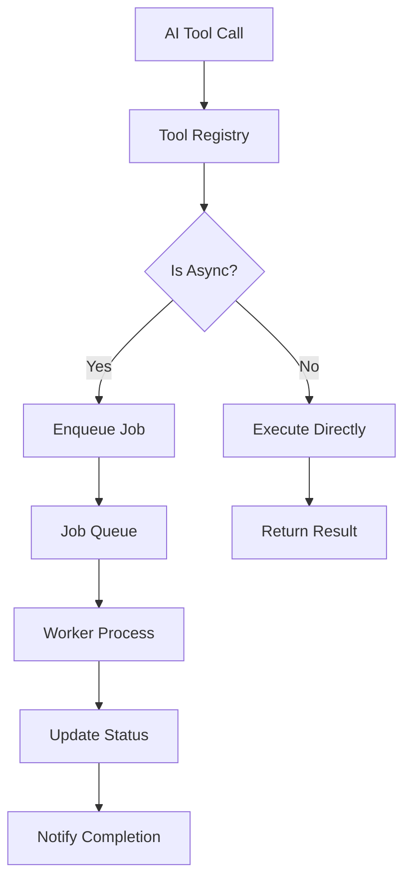
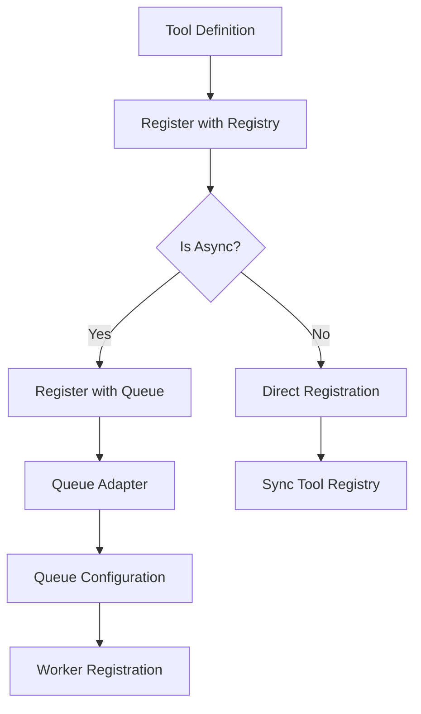

# AI-First, UI-Compatible Architecture

---

*"The future belongs to those who build for AI first while serving human interfaces seamlessly."*

---

## Executive Summary

We stand at the precipice of a fundamental shift in how we design and consume APIs. The traditional REST-based architecture, while functional, creates friction for both AI systems and human developers. This whitepaper presents a revolutionary approach: **Everything as Tools** - an AI-first, UI-compatible architecture that reimagines every API operation as a discoverable, composable tool that serves both AI systems and human interfaces seamlessly.

## The Problem: Fragmented API Architecture

### The Current State

Today's APIs are designed primarily for human developers, creating challenges for both AI systems and modern user interfaces. Traditional REST APIs expect developers to:
- Read extensive documentation
- Understand complex authentication flows
- Handle inconsistent rate limiting
- Manage varying error states
- Compose complex workflows manually

While this approach works for experienced developers, it creates significant friction for:
- **AI systems** that must parse inconsistent documentation and handle varying patterns
- **UI developers** who need consistent, discoverable interfaces
- **Modern applications** that require seamless integration across multiple services

### The AI Mismatch

Consider a simple workflow: "Create a website with content about AI tools, apply a modern design, and deploy it."

**Traditional REST Approach:**
```
POST /api/sites
POST /api/sites/{id}/content
POST /api/sites/{id}/design
POST /api/sites/{id}/deploy
```

**Problems:**
- AI must know the correct order
- No dependency information
- Inconsistent error handling
- No progress tracking
- Manual state management

## The Solution: Everything as Tools

### The Vision

Imagine a world where every API operation is a **tool** - a self-describing, composable function that can be discovered, understood, and orchestrated by both AI systems and human interfaces. This unified approach eliminates the fragmentation between different consumer types.

**Tool-Based Approach:**

```json
{
  "tool": "create_complete_website",
  "type": "async",
  "description": "Create a website with content, design, and deployment",
  "parameters": {
    "topic": "AI tools",
    "style": "modern",
    "features": ["blog", "contact", "analytics"]
  },
  "function": {
    "queue": "website-generation-queue"
  },
  "composition": [
    "generate_site_structure",
    "create_content",
    "apply_design_system", 
    "deploy_site"
  ]
}
```

### Core Principles

#### 1. **Self-Describing Tools**
Every tool contains its own documentation, parameter schemas, and capability descriptions.

```json
{
  "tool": "generate_blog_content",
  "type": "sync",
  "description": "Create engaging blog posts about the specified topic",
  "parameters": {
    "topic": {
      "type": "string",
      "description": "The main topic to write about"
    },
    "tone": {
      "type": "string", 
      "enum": ["professional", "casual", "technical"],
      "default": "professional"
    },
    "word_count": {
      "type": "number",
      "minimum": 100,
      "maximum": 2000
    }
  },
  "function": {
    "endpoint": "https://content-service.example.com/generate-blog"
  },
  "capabilities": ["content_generation", "seo_optimization"],
  "estimated_cost": 0.25,
  "estimated_time": "30s"
}
```

#### 2. **Discoverable Architecture**
Both AI systems and human interfaces can dynamically discover available tools and their capabilities.

```json
{
  "tool": "discover_tools",
  "type": "sync",
  "description": "Find available tools matching criteria",
  "parameters": {
    "category": "content_generation",
    "max_cost": 1.00,
    "max_time": "5m"
  },
  "function": {
    "endpoint": "https://registry.example.com/discover"
  },
  "response": {
    "tools": [
      {
        "tool": "generate_blog_content",
        "type": "sync",
        "description": "Create blog posts",
        "capabilities": ["content_generation", "seo_optimization"]
      },
      {
        "tool": "create_product_description",
        "type": "async",
        "description": "Write product descriptions",
        "capabilities": ["content_generation", "conversion_optimization"]
      }
    ]
  }
}
```

#### 3. **Composable Workflows**
Tools can be chained, combined, and orchestrated automatically by both AI systems and human interfaces.

```json
{
  "tool": "orchestrate_marketing_campaign",
  "type": "async",
  "description": "Create a complete marketing campaign",
  "function": {
    "queue": "marketing-campaign-queue"
  },
  "workflow": [
    {
      "tool": "analyze_target_audience",
      "type": "sync",
      "parameters": {"demographics": "tech_professionals"}
    },
    {
      "tool": "generate_campaign_content",
      "type": "async",
      "parameters": {"audience_insights": "{{previous_result}}"}
    },
    {
      "tool": "create_landing_page",
      "type": "async",
      "parameters": {"content": "{{previous_result}}"}
    },
    {
      "tool": "setup_analytics",
      "type": "sync",
      "parameters": {"page_id": "{{previous_result.page_id}}"}
    }
  ]
}
```

## The Architecture: DeepRapid AI

### Core Components

#### 1. **Tool Registry**
The central nervous system of the architecture that manages both synchronous and asynchronous tools.

```json
{
  "tool_registry": {
    "tools": {
      "create_site": {
        "type": "async",
        "version": "1.0.0",
        "description": "Generate a new website",
        "parameters": {...},
        "function": {
          "queue": "site-generation-queue"
        },
        "capabilities": ["site_building", "content_generation"],
        "estimated_cost": 0.50,
        "estimated_time": "2m"
      },
      "validate_email": {
        "type": "sync",
        "version": "1.0.0",
        "description": "Validate email format",
        "parameters": {...},
        "function": {
          "endpoint": "https://validation-service.example.com/validate-email"
        },
        "capabilities": ["validation"],
        "estimated_cost": 0.01,
        "estimated_time": "100ms"
      }
    },
    "categories": {
      "site_building": ["create_site", "update_site", "deploy_site"],
      "content_generation": ["generate_text", "create_image", "translate_content"],
      "validation": ["validate_email", "validate_phone", "validate_url"]
    }
  }
}
```

### Tool Registration and Invocation

The architecture supports both synchronous and asynchronous tools through a unified interface. Every tool is essentially a function that can be invoked in two different ways.

#### **Tool Registration**

Tools are registered with their definition and invocation method:

**Synchronous Tool Registration:**
```json
POST /api/tools/register
{
  "tool": "generate_text",
  "type": "sync",
  "description": "Generate text content",
  "parameters": {
    "prompt": {"type": "string", "required": true}
  },
  "function": {
    "endpoint": "https://text-service.example.com/generate"
  }
}
```

**Asynchronous Tool Registration:**
```json
POST /api/tools/register
{
  "tool": "generate_website",
  "type": "async", 
  "description": "Generate complete website",
  "parameters": {
    "topic": {"type": "string", "required": true}
  },
  "function": {
    "queue": "website-generation-queue"
  }
}
```

#### **Tool Invocation**

The same unified API handles both sync and async tool execution:

**Synchronous Tool Execution:**
```
POST /api/tools/execute
{
  "tool": "generate_text",
  "parameters": {"prompt": "Write about AI"}
}
```
→ **Direct HTTP/gRPC call** to the function
→ **Immediate response** with result

**Asynchronous Tool Execution:**
```
POST /api/tools/execute
{
  "tool": "generate_website", 
  "parameters": {"topic": "AI tools"}
}
```
→ **Queue task** for the function
→ **Return job_id immediately**
→ **Function processes** when queue is consumed
    
#### **Key Benefits**

**Unified Interface:** The same API handles both sync and async tools transparently.

**Function Reuse:** The same function logic can be used for both sync and async invocation patterns.

**Flexible Deployment:** Choose sync for immediate results or async for long-running operations.

**Scalable Architecture:** Async tools can handle high load through queue-based processing.
```

### Async Task Processing

The architecture supports both synchronous and asynchronous tool execution through a unified interface. Asynchronous tools use a queue-based system that abstracts the underlying message queue technology, allowing the system to work with any queue implementation.

**Key Benefits:**
- **Vendor Agnostic** - Switch between queue systems without code changes
- **Testing** - Use in-memory queues for fast, reliable tests
- **Scaling** - Start with simple queues, scale to enterprise systems as needed
- **Multi-Region** - Different queues for different regions

### Tool Execution Flow



### Tool Registration Flow



#### 2. **Tool Executor**
The intelligent engine that orchestrates tool execution and workflow management.

**Key Capabilities:**
- **Parameter Validation** - Ensures tools receive valid inputs
- **Permission Management** - Controls access to tools and resources
- **Usage Tracking** - Monitors tool usage for optimization
- **Workflow Orchestration** - Manages complex multi-tool workflows
- **Error Handling** - Provides intelligent retry and recovery mechanisms
- **Parallel Execution** - Runs independent tools simultaneously


#### 3. **Intelligent Gateway**
The unified interface that optimizes tool execution for both AI systems and human interfaces.

**Key Capabilities:**
- **Tool Discovery** - Dynamically finds and recommends available tools for any consumer
- **Parameter Validation** - Ensures valid inputs regardless of consumer type
- **Workflow Orchestration** - Intelligently chains tools into complex workflows
- **Error Handling** - Provides smart retry and recovery mechanisms
- **Cost Optimization** - Selects the most efficient tools for each task
- **Performance Monitoring** - Tracks and optimizes tool performance across all consumers

### Tool Categories

#### **Synchronous Tools** (Immediate execution)
Synchronous tools provide immediate results through direct function calls. They are ideal for:
- **Quick operations** - Email validation, text formatting
- **Real-time responses** - Analytics queries, simple calculations
- **Lightweight tasks** - Data validation, simple transformations

**Examples:**
- `validate_email` - Email format validation
- `generate_simple_text` - Quick text generation
- `get_site_analytics` - Real-time analytics queries
- `apply_design_system` - Design rule application

#### **Asynchronous Tools** (Background processing)
Asynchronous tools handle long-running operations through queue-based processing. They are ideal for:
- **Heavy computations** - Data processing, ML training
- **Time-consuming tasks** - Website generation, content creation
- **Resource-intensive operations** - File processing, batch operations

**Examples:**
- `generate_website` - Complete website generation
- `process_large_dataset` - Data processing and analysis
- `train_custom_classifier` - Machine learning model training
- `crawl_website` - Web crawling and analysis

### Architectural Components

A complete "Everything as Tools" implementation consists of several key components:

**Core Components:**
- **Tool Registry** - Central repository for tool definitions and discovery
- **Tool Executor** - Intelligent engine for tool execution and workflow management
- **AI Gateway** - Optimized interface for AI consumption
- **Async Task Processing** - Queue-based system for long-running operations
- **Workflow Orchestrator** - Manages complex multi-tool workflows

**Supporting Infrastructure:**
- **Queue Adapters** - Abstract interfaces for different message queue systems
- **Worker Functions** - Serverless functions that process async tasks
- **Interface Functions** - HTTP endpoints that queue async tasks
- **Monitoring & Observability** - Track tool performance and usage

**Key Architectural Principles:**
- **Extensibility** - Add new tools without changing existing architecture
- **Isolation** - Each tool operates independently
- **Scalability** - Tools can scale independently based on demand
- **Platform Agnostic** - Works on any cloud or on-premises infrastructure
- **Consumer Agnostic** - Same tools serve AI systems and human interfaces
- **Transport Flexible** - Tools work over HTTP, gRPC, or other protocols

### Unified Interface Design

The architecture provides a unified interface that serves multiple consumer types:

**For AI Systems:**
- **Natural discovery** - AI can find tools that match its needs
- **Intelligent composition** - AI can chain tools into complex workflows
- **Error recovery** - AI can handle failures and find alternatives
- **Cost optimization** - AI can choose the most efficient tools

**For Human Interfaces:**
- **Consistent patterns** - Same tool interface across all applications
- **Self-documenting** - Tools describe their own capabilities
- **Easy integration** - Simple API patterns for UI developers
- **Real-time feedback** - Progress tracking for async operations

### Key Architectural Benefits

The "Everything as Tools" architecture provides several fundamental advantages:

- **AI-Native, UI-Compatible Design** - Built for AI consumption while serving human interfaces seamlessly
- **Infinite Extensibility** - Add new tools without architectural changes
- **Intelligent Orchestration** - Both AI and humans can compose complex workflows automatically
- **Future-Proof** - Architecture evolves with AI capabilities while maintaining human usability
- **Universal Compatibility** - Works with any AI system, UI framework, or platform
- **Transport Flexibility** - Tools work over HTTP, gRPC, or any network protocol

## Why This is the Future

### 1. **AI-Native, UI-Compatible Design**
Unlike traditional APIs that require adaptation for different consumers, this architecture is built for AI from the ground up while serving human interfaces seamlessly. Every tool is:
- **Self-documenting** - Both AI and humans understand capabilities automatically
- **Consistent** - Same patterns across all operations and consumers
- **Discoverable** - AI and humans can find new tools dynamically
- **Composable** - Tools can be combined intelligently by any consumer

### 2. **Infinite Extensibility**
Adding new functionality is as simple as registering a new tool. No breaking changes, no version conflicts, no migration headaches.

```json
{
  "tool": "register_new_tool",
  "description": "Add a new tool to the registry",
  "parameters": {
    "tool_definition": "object"
  }
}
```

### 3. **Intelligent Orchestration**
AI can automatically compose complex workflows that would require extensive human planning.

```json
{
  "tool": "create_enterprise_site",
  "description": "Build a complete enterprise website",
  "workflow": [
    "analyze_competitors",
    "research_keywords", 
    "generate_content_strategy",
    "create_site_structure",
    "generate_all_content",
    "apply_enterprise_design",
    "setup_analytics",
    "configure_seo",
    "deploy_with_monitoring"
  ]
}
```

### 4. **Future-Proof Architecture**
As AI capabilities evolve, the architecture evolves with them:
- **New AI models** can discover and use tools automatically
- **Advanced reasoning** can compose more complex workflows
- **Learning systems** can optimize tool selection
- **Multi-agent systems** can coordinate tool usage

### 5. **Universal Compatibility**
This approach works for:
- **Function calling** in LLMs
- **Tool calling** in AI assistants
- **Web applications** and user interfaces
- **Mobile apps** and native applications
- **Workflow automation** systems
- **Multi-agent systems** and AI coordination
- **Direct API** consumption by any client

## Real-World Impact

### For Developers
- **Simplified integration** - One interface pattern to learn
- **Automatic documentation** - Tools describe themselves
- **Built-in monitoring** - Usage tracking and analytics
- **Error handling** - Consistent patterns across all tools
- **Transport flexibility** - Work with HTTP, gRPC, or any protocol

### For AI Systems
- **Natural discovery** - Find tools that match needs
- **Intelligent composition** - Chain tools automatically
- **Error recovery** - Handle failures gracefully
- **Cost optimization** - Choose most efficient tools

### For Human Interfaces
- **Consistent patterns** - Same tool interface across applications
- **Self-documenting** - Tools describe their capabilities
- **Easy integration** - Simple API patterns for UI developers
- **Real-time feedback** - Progress tracking for async operations

### For Businesses
- **Faster development** - Both AI and humans can build complex systems
- **Reduced maintenance** - Self-documenting architecture
- **Better user experience** - AI-native interfaces with human usability
- **Competitive advantage** - Future-ready technology that serves all consumers

## Key Implementation Concepts

### Tool Discovery
AI can dynamically discover available tools and their capabilities:

```json
{
    "tools": [
        {
            "name": "generate_blog_content",
            "description": "Create blog posts",
            "capabilities": ["content_generation", "seo_optimization"],
            "estimated_cost": 0.25,
            "estimated_time": "30s"
        }
    ]
}
```

### Tool Composition
Complex workflows can be composed automatically:

```json
{
    "workflow": [
        {"tool": "analyze_target_audience", "parameters": {...}},
        {"tool": "generate_campaign_content", "parameters": {...}},
        {"tool": "create_landing_page", "parameters": {...}},
        {"tool": "setup_analytics", "parameters": {...}}
    ]
}
```

### Error Handling & Recovery
The architecture provides robust error handling with intelligent retry logic for both sync and async tools:

**Key Features:**
- **Automatic retry** - Failed tools are retried with exponential backoff
- **Alternative tools** - System can find and use alternative tools when primary tools fail
- **Graceful degradation** - Partial failures don't break entire workflows
- **Error reporting** - Detailed error information for debugging and monitoring
- **Consumer-agnostic** - Same error handling works for AI and human interfaces

### Progress Tracking
Real-time status updates for async operations provide transparency for both AI systems and human interfaces:

**Key Features:**
- **Real-time updates** - Progress tracking for long-running operations
- **Status monitoring** - Check job status and estimated completion time
- **Result retrieval** - Get final results when async operations complete
- **Consumer notifications** - Both AI and human interfaces receive progress updates
- **Unified interface** - Same progress tracking works for all async tools

## The Road Ahead

### Phase 1: Foundation
- Build core tool registry
- Implement basic tool execution
- Create AI gateway
- Establish tool discovery

### Phase 2: Intelligence
- Add workflow orchestration
- Implement cost optimization
- Build error recovery systems
- Add learning capabilities

### Phase 3: Evolution
- Multi-agent coordination
- Advanced reasoning
- Predictive tool selection
- Autonomous system building

## Conclusion

The future of software is AI-first while serving human interfaces seamlessly. Traditional REST APIs, while functional, create friction for both AI systems and modern user interfaces. The "Everything as Tools" architecture represents a paradigm shift that:

- **Embraces AI** as the primary consumer while serving human interfaces
- **Enables infinite extensibility** through tool composition
- **Provides intelligent orchestration** of complex workflows for all consumers
- **Creates future-proof systems** that evolve with AI capabilities while maintaining human usability

This is not just a new way to build APIs—it's a new way to think about software itself. In a world where AI and human interfaces work together, we need architectures that serve both seamlessly.

The future belongs to those who build for AI first while serving human interfaces. The "Everything as Tools" architecture is that future.

---

*"In the age of AI, the best APIs are those that AI can discover, understand, and orchestrate automatically."*

---

**DeepRapid AI** - Building the future, one tool at a time. 