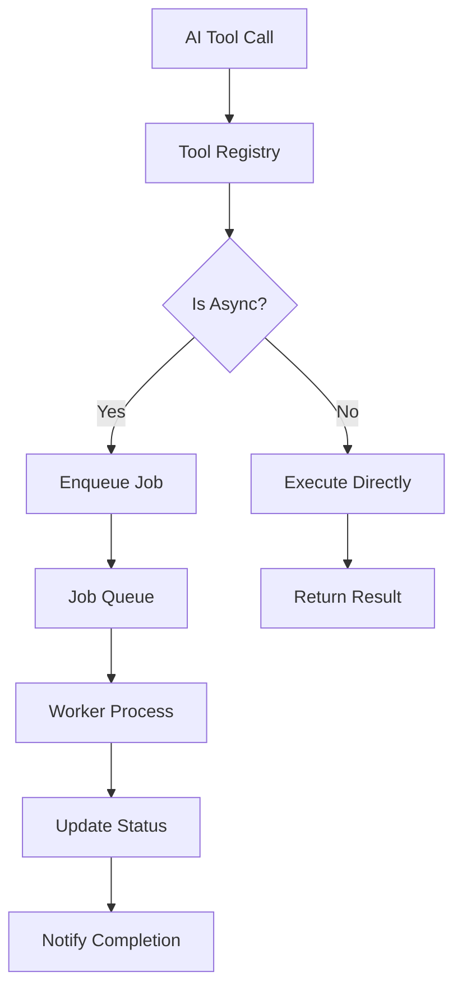
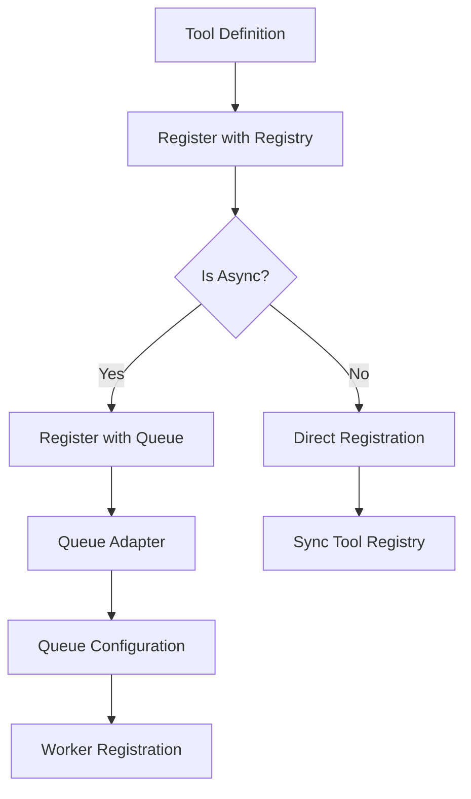

# AI-First Architecture

---

*"The future belongs to those who build for AI first."*

---

## Executive Summary

We stand at the precipice of a fundamental shift in how we design and consume APIs. The traditional REST-based architecture, while effective for human developers, is fundamentally misaligned with how AI systems think, discover, and compose functionality. This whitepaper presents a revolutionary approach: **Everything as Tools** - an AI-first architecture that reimagines every API operation as a discoverable, composable, and AI-native tool.

## The Problem: AI-Second Architecture

### The Current State

Today's APIs are designed with humans in mind. They follow REST conventions, use HTTP methods, and expect developers to:
- Read documentation
- Understand authentication flows
- Handle rate limiting
- Manage error states
- Compose complex workflows manually

While this works for human developers, it creates significant friction for AI systems. AI must:
- Parse inconsistent documentation
- Handle varying authentication patterns
- Manage complex state across multiple endpoints
- Deal with different error formats
- Compose workflows without understanding dependencies

### The AI Mismatch

Consider a simple workflow: "Create a website with content about AI tools, apply a modern design, and deploy it."

**Traditional REST Approach:**
```
POST /api/sites
POST /api/sites/{id}/content
POST /api/sites/{id}/design
POST /api/sites/{id}/deploy
```

**Problems:**
- AI must know the correct order
- No dependency information
- Inconsistent error handling
- No progress tracking
- Manual state management

## The Solution: Everything as Tools

### The Vision

Imagine a world where every API operation is a **tool** - a self-describing, composable function that AI can discover, understand, and orchestrate automatically.

**Tool-Based Approach:**

```json
{
  "tool": "create_complete_website",
  "description": "Create a website with content, design, and deployment",
  "parameters": {
    "topic": "AI tools",
    "style": "modern",
    "features": ["blog", "contact", "analytics"]
  },
  "composition": [
    "generate_site_structure",
    "create_content",
    "apply_design_system", 
    "deploy_site"
  ]
}
```

### Core Principles

#### 1. **Self-Describing Tools**
Every tool contains its own documentation, parameter schemas, and capability descriptions.

```json
{
  "tool": "generate_blog_content",
  "description": "Create engaging blog posts about the specified topic",
  "parameters": {
    "topic": {
      "type": "string",
      "description": "The main topic to write about"
    },
    "tone": {
      "type": "string", 
      "enum": ["professional", "casual", "technical"],
      "default": "professional"
    },
    "word_count": {
      "type": "number",
      "minimum": 100,
      "maximum": 2000
    }
  },
  "capabilities": ["content_generation", "seo_optimization"],
  "estimated_cost": 0.25,
  "estimated_time": "30s"
}
```

#### 2. **Discoverable Architecture**
AI can dynamically discover available tools and their capabilities.

```json
{
  "tool": "discover_tools",
  "description": "Find available tools matching criteria",
  "parameters": {
    "category": "content_generation",
    "max_cost": 1.00,
    "max_time": "5m"
  },
  "response": {
    "tools": [
      {
        "tool": "generate_blog_content",
        "description": "Create blog posts",
        "capabilities": ["content_generation", "seo_optimization"]
      },
      {
        "tool": "create_product_description", 
        "description": "Write product descriptions",
        "capabilities": ["content_generation", "conversion_optimization"]
      }
    ]
  }
}
```

#### 3. **Composable Workflows**
Tools can be chained, combined, and orchestrated automatically.

```json
{
  "tool": "orchestrate_marketing_campaign",
  "description": "Create a complete marketing campaign",
  "workflow": [
    {
      "tool": "analyze_target_audience",
      "parameters": {"demographics": "tech_professionals"}
    },
    {
      "tool": "generate_campaign_content",
      "parameters": {"audience_insights": "{{previous_result}}"}
    },
    {
      "tool": "create_landing_page",
      "parameters": {"content": "{{previous_result}}"}
    },
    {
      "tool": "setup_analytics",
      "parameters": {"page_id": "{{previous_result.page_id}}"}
    }
  ]
}
```

## The Architecture: DeepRapid AI

### Core Components

#### 1. **Tool Registry**
The central nervous system of the architecture.

```json
{
  "tool_registry": {
    "tools": {
      "create_site": {
        "version": "1.0.0",
        "description": "Generate a new website",
        "parameters": {...},
        "capabilities": ["site_building", "content_generation"],
        "estimated_cost": 0.50,
        "estimated_time": "2m"
      }
    },
    "categories": {
      "site_building": ["create_site", "update_site", "deploy_site"],
      "content_generation": ["generate_text", "create_image", "translate_content"],
      "design": ["extract_branding", "apply_design_system", "generate_mockup"]
    }
  }
}
```

### Tool Registration and Invocation

The architecture supports both synchronous and asynchronous tools through a unified interface. Every tool is essentially a function that can be invoked in two different ways.

#### **Tool Registration**

Tools are registered with their definition and invocation method:

**Synchronous Tool Registration:**
```json
POST /api/tools/register
{
  "tool": "generate_text",
  "type": "sync",
  "description": "Generate text content",
  "parameters": {
    "prompt": {"type": "string", "required": true}
  },
  "function": {
    "endpoint": "https://text-service.example.com/generate"
  }
}
```

**Asynchronous Tool Registration:**
```json
POST /api/tools/register
{
  "tool": "generate_website",
  "type": "async", 
  "description": "Generate complete website",
  "parameters": {
    "topic": {"type": "string", "required": true}
  },
  "function": {
    "queue": "website-generation-queue"
  }
}
```

#### **Tool Invocation**

The same unified API handles both sync and async tool execution:

**Synchronous Tool Execution:**
```
POST /api/tools/execute
{
  "tool": "generate_text",
  "parameters": {"prompt": "Write about AI"}
}
```
→ **Direct HTTP/gRPC call** to the function
→ **Immediate response** with result

**Asynchronous Tool Execution:**
```
POST /api/tools/execute
{
  "tool": "generate_website", 
  "parameters": {"topic": "AI tools"}
}
```
→ **Queue task** for the function
→ **Return job_id immediately**
→ **Function processes** when queue is consumed
    
#### **Key Benefits**

**Unified Interface:** The same API handles both sync and async tools transparently.

**Function Reuse:** The same function logic can be used for both sync and async invocation patterns.

**Flexible Deployment:** Choose sync for immediate results or async for long-running operations.

**Scalable Architecture:** Async tools can handle high load through queue-based processing.
```

### Async Task Processing

The architecture supports both synchronous and asynchronous tool execution through a unified interface. Asynchronous tools use a queue-based system that abstracts the underlying message queue technology, allowing the system to work with any queue implementation.

**Key Benefits:**
- **Vendor Agnostic** - Switch between queue systems without code changes
- **Testing** - Use in-memory queues for fast, reliable tests
- **Scaling** - Start with simple queues, scale to enterprise systems as needed
- **Multi-Region** - Different queues for different regions

### Tool Execution Flow



### Tool Registration Flow



#### 2. **Tool Executor**
The intelligent engine that orchestrates tool execution and workflow management.

**Key Capabilities:**
- **Parameter Validation** - Ensures tools receive valid inputs
- **Permission Management** - Controls access to tools and resources
- **Usage Tracking** - Monitors tool usage for optimization
- **Workflow Orchestration** - Manages complex multi-tool workflows
- **Error Handling** - Provides intelligent retry and recovery mechanisms
- **Parallel Execution** - Runs independent tools simultaneously


#### 3. **AI Gateway**
The intelligent interface that optimizes tool execution for AI consumption.

**Key Capabilities:**
- **Tool Discovery** - Dynamically finds and recommends available tools
- **Parameter Validation** - Ensures AI provides valid inputs to tools
- **Workflow Orchestration** - Intelligently chains tools into complex workflows
- **Error Handling** - Provides smart retry and recovery mechanisms
- **Cost Optimization** - Selects the most efficient tools for each task
- **Performance Monitoring** - Tracks and optimizes tool performance

### Tool Categories

#### **Synchronous Tools** (Immediate execution)
Synchronous tools provide immediate results through direct function calls. They are ideal for:
- **Quick operations** - Email validation, text formatting
- **Real-time responses** - Analytics queries, simple calculations
- **Lightweight tasks** - Data validation, simple transformations

**Examples:**
- `validate_email` - Email format validation
- `generate_simple_text` - Quick text generation
- `get_site_analytics` - Real-time analytics queries
- `apply_design_system` - Design rule application

#### **Asynchronous Tools** (Background processing)
Asynchronous tools handle long-running operations through queue-based processing. They are ideal for:
- **Heavy computations** - Data processing, ML training
- **Time-consuming tasks** - Website generation, content creation
- **Resource-intensive operations** - File processing, batch operations

**Examples:**
- `generate_website` - Complete website generation
- `process_large_dataset` - Data processing and analysis
- `train_custom_classifier` - Machine learning model training
- `crawl_website` - Web crawling and analysis

### Architectural Components

A complete "Everything as Tools" implementation consists of several key components:

**Core Components:**
- **Tool Registry** - Central repository for tool definitions and discovery
- **Tool Executor** - Intelligent engine for tool execution and workflow management
- **AI Gateway** - Optimized interface for AI consumption
- **Async Task Processing** - Queue-based system for long-running operations
- **Workflow Orchestrator** - Manages complex multi-tool workflows

**Supporting Infrastructure:**
- **Queue Adapters** - Abstract interfaces for different message queue systems
- **Worker Functions** - Serverless functions that process async tasks
- **Interface Functions** - HTTP endpoints that queue async tasks
- **Monitoring & Observability** - Track tool performance and usage

**Key Architectural Principles:**
- **Extensibility** - Add new tools without changing existing architecture
- **Isolation** - Each tool operates independently
- **Scalability** - Tools can scale independently based on demand
- **Platform Agnostic** - Works on any cloud or on-premises infrastructure

### Key Architectural Benefits

The "Everything as Tools" architecture provides several fundamental advantages:

- **AI-Native Design** - Built for AI consumption from the ground up
- **Infinite Extensibility** - Add new tools without architectural changes
- **Intelligent Orchestration** - AI can compose complex workflows automatically
- **Future-Proof** - Architecture evolves with AI capabilities
- **Universal Compatibility** - Works with any AI system or platform

## Why This is the Future

### 1. **AI-Native Design**
Unlike traditional APIs that AI must adapt to, this architecture is built for AI from the ground up. Every tool is:
- **Self-documenting** - AI understands capabilities automatically
- **Consistent** - Same patterns across all operations
- **Discoverable** - AI can find new tools dynamically
- **Composable** - Tools can be combined intelligently

### 2. **Infinite Extensibility**
Adding new functionality is as simple as registering a new tool. No breaking changes, no version conflicts, no migration headaches.

```json
{
  "tool": "register_new_tool",
  "description": "Add a new tool to the registry",
  "parameters": {
    "tool_definition": "object"
  }
}
```

### 3. **Intelligent Orchestration**
AI can automatically compose complex workflows that would require extensive human planning.

```json
{
  "tool": "create_enterprise_site",
  "description": "Build a complete enterprise website",
  "workflow": [
    "analyze_competitors",
    "research_keywords", 
    "generate_content_strategy",
    "create_site_structure",
    "generate_all_content",
    "apply_enterprise_design",
    "setup_analytics",
    "configure_seo",
    "deploy_with_monitoring"
  ]
}
```

### 4. **Future-Proof Architecture**
As AI capabilities evolve, the architecture evolves with them:
- **New AI models** can discover and use tools automatically
- **Advanced reasoning** can compose more complex workflows
- **Learning systems** can optimize tool selection
- **Multi-agent systems** can coordinate tool usage

### 5. **Universal Compatibility**
This approach works for:
- **Function calling** in LLMs
- **Tool calling** in AI assistants
- **Direct API** consumption
- **Workflow automation**
- **Multi-agent systems**

## Real-World Impact

### For Developers
- **Simplified integration** - One interface pattern to learn
- **Automatic documentation** - Tools describe themselves
- **Built-in monitoring** - Usage tracking and analytics
- **Error handling** - Consistent patterns across all tools

### For AI Systems
- **Natural discovery** - Find tools that match needs
- **Intelligent composition** - Chain tools automatically
- **Error recovery** - Handle failures gracefully
- **Cost optimization** - Choose most efficient tools

### For Businesses
- **Faster development** - AI can build complex systems
- **Reduced maintenance** - Self-documenting architecture
- **Better user experience** - AI-native interfaces
- **Competitive advantage** - Future-ready technology

## Key Implementation Concepts

### Tool Discovery
AI can dynamically discover available tools and their capabilities:

```json
{
    "tools": [
        {
            "name": "generate_blog_content",
            "description": "Create blog posts",
            "capabilities": ["content_generation", "seo_optimization"],
            "estimated_cost": 0.25,
            "estimated_time": "30s"
        }
    ]
}
```

### Tool Composition
Complex workflows can be composed automatically:

```json
{
    "workflow": [
        {"tool": "analyze_target_audience", "parameters": {...}},
        {"tool": "generate_campaign_content", "parameters": {...}},
        {"tool": "create_landing_page", "parameters": {...}},
        {"tool": "setup_analytics", "parameters": {...}}
    ]
}
```

### Error Handling & Recovery
Robust error handling with intelligent retry logic:

**Python:**
```python
# Automatic error recovery
async def execute_with_recovery(tool_name, params):
    try:
        return await tool_registry.execute_tool(tool_name, params)
    except ToolError as e:
        # Try alternative tool
        alternative = await find_alternative_tool(tool_name)
        if alternative:
            return await tool_registry.execute_tool(alternative, params)
        raise
```

**JavaScript:**
```javascript
// Automatic error recovery
async function executeWithRecovery(toolName, params) {
    try {
        return await toolRegistry.executeTool(toolName, params);
    } catch (error) {
        if (error instanceof ToolError) {
            // Try alternative tool
            const alternative = await findAlternativeTool(toolName);
            if (alternative) {
                return await toolRegistry.executeTool(alternative, params);
            }
        }
        throw error;
    }
}
```

**Go:**
```go
// Automatic error recovery
func executeWithRecovery(toolName string, params map[string]interface{}) (ToolResult, error) {
    result, err := toolRegistry.ExecuteTool(toolName, params)
    if err != nil {
        if toolErr, ok := err.(*ToolError); ok {
            // Try alternative tool
            if alternative, found := findAlternativeTool(toolName); found {
                return toolRegistry.ExecuteTool(alternative, params)
            }
        }
        return ToolResult{}, err
    }
    return result, nil
}
```

**Rust:**
```rust
// Automatic error recovery
async fn execute_with_recovery(tool_name: &str, params: &HashMap<String, Value>) -> Result<ToolResult, ToolError> {
    match tool_registry.execute_tool(tool_name, params).await {
        Ok(result) => Ok(result),
        Err(e) => {
            if let Some(alternative) = find_alternative_tool(tool_name).await? {
                tool_registry.execute_tool(&alternative, params).await
            } else {
                Err(e)
            }
        }
    }
}
```

### Progress Tracking
Real-time status updates for async operations:

**Python:**
```python
# Track async job progress
job_id = await tool_registry.execute_tool("generate_website", params)

# Check status
status = await tool_registry.get_job_status(job_id)
# Returns: {"status": "processing", "progress": 65, "eta": "2m"}

# Get final result
result = await tool_registry.get_job_result(job_id)
# Returns: {"url": "https://site.com", "status": "completed"}
```

**JavaScript:**
```javascript
// Track async job progress
const jobId = await toolRegistry.executeTool("generate_website", params);

// Check status
const status = await toolRegistry.getJobStatus(jobId);
// Returns: { status: "processing", progress: 65, eta: "2m" }

// Get final result
const result = await toolRegistry.getJobResult(jobId);
// Returns: { url: "https://site.com", status: "completed" }
```

**Go:**
```go
// Track async job progress
jobID, err := toolRegistry.ExecuteTool("generate_website", params)

// Check status
status, err := toolRegistry.GetJobStatus(jobID)
// Returns: {"status": "processing", "progress": 65, "eta": "2m"}

// Get final result
result, err := toolRegistry.GetJobResult(jobID)
// Returns: {"url": "https://site.com", "status": "completed"}
```

**Rust:**
```rust
// Track async job progress
let job_id = tool_registry.execute_tool("generate_website", params).await?;

// Check status
let status = tool_registry.get_job_status(&job_id).await?;
// Returns: {"status": "processing", "progress": 65, "eta": "2m"}

// Get final result
let result = tool_registry.get_job_result(&job_id).await?;
// Returns: {"url": "https://site.com", "status": "completed"}
```

## The Road Ahead

### Phase 1: Foundation
- Build core tool registry
- Implement basic tool execution
- Create AI gateway
- Establish tool discovery

### Phase 2: Intelligence
- Add workflow orchestration
- Implement cost optimization
- Build error recovery systems
- Add learning capabilities

### Phase 3: Evolution
- Multi-agent coordination
- Advanced reasoning
- Predictive tool selection
- Autonomous system building

## Conclusion

The future of software is AI-first. Traditional REST APIs, while functional, are fundamentally misaligned with how AI systems think and operate. The "Everything as Tools" architecture represents a paradigm shift that:

- **Embraces AI** as the primary consumer
- **Enables infinite extensibility** through tool composition
- **Provides intelligent orchestration** of complex workflows
- **Creates future-proof systems** that evolve with AI capabilities

This is not just a new way to build APIs—it's a new way to think about software itself. In a world where AI is becoming the primary interface between humans and technology, we need architectures that speak AI's language.

The future belongs to those who build for AI first. The "Everything as Tools" architecture is that future.

---

*"In the age of AI, the best APIs are those that AI can discover, understand, and orchestrate automatically."*

---

**DeepRapid AI** - Building the future, one tool at a time. 