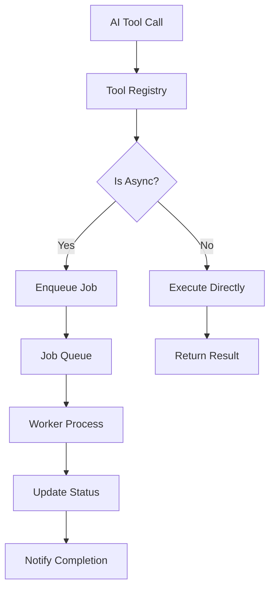
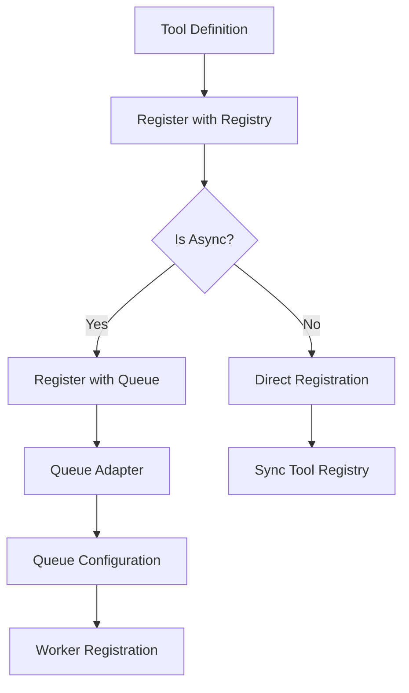

# AI-First Architecture

---

*"The future belongs to those who build for AI first."*

---

## Executive Summary

We stand at the precipice of a fundamental shift in how we design and consume APIs. The traditional REST-based architecture, while effective for human developers, is fundamentally misaligned with how AI systems think, discover, and compose functionality. This whitepaper presents a revolutionary approach: **Everything as Tools** - an AI-first architecture that reimagines every API operation as a discoverable, composable, and AI-native tool.

## The Problem: AI-Second Architecture

### The Current State

Today's APIs are designed with humans in mind. They follow REST conventions, use HTTP methods, and expect developers to:
- Read documentation
- Understand authentication flows
- Handle rate limiting
- Manage error states
- Compose complex workflows manually

While this works for human developers, it creates significant friction for AI systems. AI must:
- Parse inconsistent documentation
- Handle varying authentication patterns
- Manage complex state across multiple endpoints
- Deal with different error formats
- Compose workflows without understanding dependencies

### The AI Mismatch

Consider a simple workflow: "Create a website with content about AI tools, apply a modern design, and deploy it."

**Traditional REST Approach:**
```
POST /api/sites
POST /api/sites/{id}/content
POST /api/sites/{id}/design
POST /api/sites/{id}/deploy
```

**Problems:**
- AI must know the correct order
- No dependency information
- Inconsistent error handling
- No progress tracking
- Manual state management

## The Solution: Everything as Tools

### The Vision

Imagine a world where every API operation is a **tool** - a self-describing, composable function that AI can discover, understand, and orchestrate automatically.

**Tool-Based Approach:**

```json
{
  "tool": "create_complete_website",
  "description": "Create a website with content, design, and deployment",
  "parameters": {
    "topic": "AI tools",
    "style": "modern",
    "features": ["blog", "contact", "analytics"]
  },
  "composition": [
    "generate_site_structure",
    "create_content",
    "apply_design_system", 
    "deploy_site"
  ]
}
```

### Core Principles

#### 1. **Self-Describing Tools**
Every tool contains its own documentation, parameter schemas, and capability descriptions.

```json
{
  "tool": "generate_blog_content",
  "description": "Create engaging blog posts about the specified topic",
  "parameters": {
    "topic": {
      "type": "string",
      "description": "The main topic to write about"
    },
    "tone": {
      "type": "string", 
      "enum": ["professional", "casual", "technical"],
      "default": "professional"
    },
    "word_count": {
      "type": "number",
      "minimum": 100,
      "maximum": 2000
    }
  },
  "capabilities": ["content_generation", "seo_optimization"],
  "estimated_cost": 0.25,
  "estimated_time": "30s"
}
```

#### 2. **Discoverable Architecture**
AI can dynamically discover available tools and their capabilities.

```json
{
  "tool": "discover_tools",
  "description": "Find available tools matching criteria",
  "parameters": {
    "category": "content_generation",
    "max_cost": 1.00,
    "max_time": "5m"
  },
  "response": {
    "tools": [
      {
        "tool": "generate_blog_content",
        "description": "Create blog posts",
        "capabilities": ["content_generation", "seo_optimization"]
      },
      {
        "tool": "create_product_description", 
        "description": "Write product descriptions",
        "capabilities": ["content_generation", "conversion_optimization"]
      }
    ]
  }
}
```

#### 3. **Composable Workflows**
Tools can be chained, combined, and orchestrated automatically.

```json
{
  "tool": "orchestrate_marketing_campaign",
  "description": "Create a complete marketing campaign",
  "workflow": [
    {
      "tool": "analyze_target_audience",
      "parameters": {"demographics": "tech_professionals"}
    },
    {
      "tool": "generate_campaign_content",
      "parameters": {"audience_insights": "{{previous_result}}"}
    },
    {
      "tool": "create_landing_page",
      "parameters": {"content": "{{previous_result}}"}
    },
    {
      "tool": "setup_analytics",
      "parameters": {"page_id": "{{previous_result.page_id}}"}
    }
  ]
}
```

## The Architecture: DeepRapid AI

### Core Components

#### 1. **Tool Registry**
The central nervous system of the architecture.

```json
{
  "tool_registry": {
    "tools": {
      "create_site": {
        "version": "1.0.0",
        "description": "Generate a new website",
        "parameters": {...},
        "capabilities": ["site_building", "content_generation"],
        "estimated_cost": 0.50,
        "estimated_time": "2m"
      }
    },
    "categories": {
      "site_building": ["create_site", "update_site", "deploy_site"],
      "content_generation": ["generate_text", "create_image", "translate_content"],
      "design": ["extract_branding", "apply_design_system", "generate_mockup"]
    }
  }
}
```

### Tool Registration Architecture

The system supports both synchronous and asynchronous tools through a unified registration interface:

**Python:**
```python
class ToolRegistry:
    def register_sync_tool(self, name: str, tool: SyncTool):
        """Register a synchronous tool for immediate execution"""
        self.sync_tools[name] = tool
    
    def register_async_tool(self, name: str, tool: AsyncTool, queue_config: QueueConfig):
        """Register an asynchronous tool with queue configuration"""
        self.async_tools[name] = tool
        self.queue_configs[name] = queue_config
    
    async def execute_tool(self, name: str, params: dict) -> ToolResult:
        """Execute a tool, handling both sync and async transparently"""
        if name in self.sync_tools:
            return await self.sync_tools[name].execute(params)
        elif name in self.async_tools:
            return await self._enqueue_async_job(name, params)
        else:
            raise ToolNotFoundError(f"Tool '{name}' not found")
```

**JavaScript:**
```javascript
class ToolRegistry {
    constructor() {
        this.syncTools = new Map();
        this.asyncTools = new Map();
        this.queueConfigs = new Map();
    }
    
    registerSyncTool(name, tool) {
        this.syncTools.set(name, tool);
    }
    
    registerAsyncTool(name, tool, queueConfig) {
        this.asyncTools.set(name, tool);
        this.queueConfigs.set(name, queueConfig);
    }
    
    async executeTool(name, params) {
        if (this.syncTools.has(name)) {
            return await this.syncTools.get(name).execute(params);
        } else if (this.asyncTools.has(name)) {
            return await this.enqueueAsyncJob(name, params);
        } else {
            throw new Error(`Tool '${name}' not found`);
        }
    }
}
```

**Go:**
```go
type ToolRegistry struct {
    syncTools    map[string]SyncTool
    asyncTools   map[string]AsyncTool
    queueConfigs map[string]QueueConfig
}

func (tr *ToolRegistry) RegisterSyncTool(name string, tool SyncTool) {
    tr.syncTools[name] = tool
}

func (tr *ToolRegistry) RegisterAsyncTool(name string, tool AsyncTool, queueConfig QueueConfig) {
    tr.asyncTools[name] = tool
    tr.queueConfigs[name] = queueConfig
}

func (tr *ToolRegistry) ExecuteTool(name string, params map[string]interface{}) (ToolResult, error) {
    if tool, exists := tr.syncTools[name]; exists {
        return tool.Execute(params)
    } else if tool, exists := tr.asyncTools[name]; exists {
        return tr.enqueueAsyncJob(name, params)
    } else {
        return ToolResult{}, fmt.Errorf("Tool '%s' not found", name)
    }
}
```

**Rust:**
```rust
struct ToolRegistry {
    sync_tools: HashMap<String, Box<dyn SyncTool>>,
    async_tools: HashMap<String, Box<dyn AsyncTool>>,
    queue_configs: HashMap<String, QueueConfig>,
}

impl ToolRegistry {
    pub fn register_sync_tool(&mut self, name: String, tool: Box<dyn SyncTool>) {
        self.sync_tools.insert(name, tool);
    }
    
    pub fn register_async_tool(&mut self, name: String, tool: Box<dyn AsyncTool>, queue_config: QueueConfig) {
        self.async_tools.insert(name.clone(), tool);
        self.queue_configs.insert(name, queue_config);
    }
    
    pub async fn execute_tool(&self, name: &str, params: HashMap<String, Value>) -> Result<ToolResult, Box<dyn std::error::Error>> {
        if let Some(tool) = self.sync_tools.get(name) {
            tool.execute(params).await
        } else if let Some(tool) = self.async_tools.get(name) {
            self.enqueue_async_job(name, params).await
        } else {
            Err(format!("Tool '{}' not found", name).into())
        }
    }
}
```

### Queue System Abstraction

The architecture supports multiple queue systems through a unified adapter pattern:

**Python:**
```python
class QueueAdapter:
    """Abstract interface for queue systems"""
    async def enqueue(self, job_id: str, payload: dict) -> str
    async def dequeue(self, queue_name: str) -> Optional[Job]
    async def get_status(self, job_id: str) -> JobStatus
    async def complete(self, job_id: str, result: dict)
    async def fail(self, job_id: str, error: str)

# Supported queue adapters
class RabbitMQAdapter(QueueAdapter): pass
class BullMQAdapter(QueueAdapter): pass
class SQSAdapter(QueueAdapter): pass
class RedisAdapter(QueueAdapter): pass
class InMemoryAdapter(QueueAdapter): pass  # For testing
```

**JavaScript:**
```javascript
class QueueAdapter {
    async enqueue(jobId, payload) { throw new Error('Not implemented'); }
    async dequeue(queueName) { throw new Error('Not implemented'); }
    async getStatus(jobId) { throw new Error('Not implemented'); }
    async complete(jobId, result) { throw new Error('Not implemented'); }
    async fail(jobId, error) { throw new Error('Not implemented'); }
}

// Supported queue adapters
class RabbitMQAdapter extends QueueAdapter {}
class BullMQAdapter extends QueueAdapter {}
class SQSAdapter extends QueueAdapter {}
class RedisAdapter extends QueueAdapter {}
class InMemoryAdapter extends QueueAdapter {} // For testing
```

**Go:**
```go
type QueueAdapter interface {
    Enqueue(jobID string, payload map[string]interface{}) (string, error)
    Dequeue(queueName string) (*Job, error)
    GetStatus(jobID string) (JobStatus, error)
    Complete(jobID string, result map[string]interface{}) error
    Fail(jobID string, error string) error
}

// Supported queue adapters
type RabbitMQAdapter struct{}
type BullMQAdapter struct{}
type SQSAdapter struct{}
type RedisAdapter struct{}
type InMemoryAdapter struct{} // For testing
```

**Rust:**
```rust
trait QueueAdapter {
    async fn enqueue(&self, job_id: &str, payload: HashMap<String, Value>) -> Result<String, Box<dyn std::error::Error>>;
    async fn dequeue(&self, queue_name: &str) -> Result<Option<Job>, Box<dyn std::error::Error>>;
    async fn get_status(&self, job_id: &str) -> Result<JobStatus, Box<dyn std::error::Error>>;
    async fn complete(&self, job_id: &str, result: HashMap<String, Value>) -> Result<(), Box<dyn std::error::Error>>;
    async fn fail(&self, job_id: &str, error: &str) -> Result<(), Box<dyn std::error::Error>>;
}

// Supported queue adapters
struct RabbitMQAdapter;
struct BullMQAdapter;
struct SQSAdapter;
struct RedisAdapter;
struct InMemoryAdapter; // For testing
```

### Tool Execution Flow



### Tool Registration Flow



#### 2. **Tool Executor**
The engine that runs tools with intelligent orchestration.

**Python:**
```python
class ToolExecutor:
    def execute_tool(self, tool_name, parameters):
        # Validate parameters
        # Check permissions
        # Execute tool
        # Track usage
        # Return results
        
    def execute_workflow(self, workflow):
        # Parse dependencies
        # Execute in parallel where possible
        # Handle failures and retries
        # Return composite results
```

**JavaScript:**
```javascript
class ToolExecutor {
    async executeTool(toolName, parameters) {
        // Validate parameters
        // Check permissions
        // Execute tool
        // Track usage
        // Return results
    }
    
    async executeWorkflow(workflow) {
        // Parse dependencies
        // Execute in parallel where possible
        // Handle failures and retries
        // Return composite results
    }
}
```

**Go:**
```go
type ToolExecutor struct{}

func (te *ToolExecutor) ExecuteTool(toolName string, parameters map[string]interface{}) (interface{}, error) {
    // Validate parameters
    // Check permissions
    // Execute tool
    // Track usage
    // Return results
}

func (te *ToolExecutor) ExecuteWorkflow(workflow Workflow) (interface{}, error) {
    // Parse dependencies
    // Execute in parallel where possible
    // Handle failures and retries
    // Return composite results
}
```

**Rust:**
```rust
struct ToolExecutor;

impl ToolExecutor {
    pub async fn execute_tool(&self, tool_name: &str, parameters: HashMap<String, Value>) -> Result<Value, Box<dyn std::error::Error>> {
        // Validate parameters
        // Check permissions
        // Execute tool
        // Track usage
        // Return results
    }
    
    pub async fn execute_workflow(&self, workflow: Workflow) -> Result<Value, Box<dyn std::error::Error>> {
        // Parse dependencies
        // Execute in parallel where possible
        // Handle failures and retries
        // Return composite results
    }
}
```


#### 3. **AI Gateway**
The intelligent router that optimizes for AI consumption.

```json
{
  "ai_gateway": {
    "capabilities": {
      "tool_discovery": "Find available tools",
      "parameter_validation": "Validate inputs",
      "workflow_orchestration": "Chain tools together",
      "error_handling": "Intelligent retry logic",
      "cost_optimization": "Choose most efficient tools"
    }
  }
}
```

### Tool Categories

#### **Synchronous Tools** (Immediate execution)
- `create_user` - User account creation
- `validate_email` - Email validation
- `get_site_analytics` - Real-time analytics
- `generate_simple_text` - Quick text generation
- `apply_design_system` - Design application
- `optimize_images` - Image optimization

#### **Asynchronous Tools** (Background processing)
- `generate_website` - Complete website generation
- `crawl_website` - Web crawling and analysis
- `process_large_dataset` - Data processing
- `generate_site_mockups` - Design mockup generation
- `analyze_performance` - Performance analysis
- `train_custom_classifier` - ML model training

### Repository Scaffolding

A complete "Everything as Tools" implementation would follow this structure:

```
everything-as-tools/
├── tool-registry/          # Core tool registration & discovery
│   ├── sync_tools.py      # Synchronous tool definitions
│   ├── async_tools.py     # Asynchronous tool definitions
│   └── registry.py        # Main registry implementation
├── job-engine/            # Async job orchestration
│   ├── workers.py         # Job processing workers
│   ├── scheduler.py       # Job scheduling logic
│   └── monitoring.py      # Job status tracking
├── queue-adapters/        # Queue system abstractions
│   ├── rabbitmq.py        # RabbitMQ adapter
│   ├── bullmq.py          # BullMQ adapter
│   ├── sqs.py             # AWS SQS adapter
│   └── redis.py           # Redis adapter
├── tool-composer/         # Tool composition & chaining
│   ├── workflow.py        # Workflow orchestration
│   ├── dependencies.py    # Dependency resolution
│   └── parallel.py        # Parallel execution
├── examples/              # Multi-language examples
│   ├── python/           # Python implementations
│   ├── nodejs/           # Node.js implementations
│   └── go/               # Go implementations
├── docs/                  # Documentation & diagrams
│   ├── architecture.md   # System architecture
│   ├── api.md            # API documentation
│   └── diagrams/         # Mermaid diagrams
└── tests/                 # Integration tests
    ├── unit/             # Unit tests
    ├── integration/      # Integration tests
    └── performance/      # Performance tests
```

### Queue System Benefits

The abstracted queue system provides several advantages:

- **Vendor Agnostic** - Switch between queue systems without code changes
- **Testing** - Use in-memory queues for fast, reliable tests
- **Scaling** - Start with Redis, scale to SQS as needed
- **Multi-Region** - Different queues for different regions
- **Cost Optimization** - Choose the most cost-effective queue for each use case

## Why This is the Future

### 1. **AI-Native Design**
Unlike traditional APIs that AI must adapt to, this architecture is built for AI from the ground up. Every tool is:
- **Self-documenting** - AI understands capabilities automatically
- **Consistent** - Same patterns across all operations
- **Discoverable** - AI can find new tools dynamically
- **Composable** - Tools can be combined intelligently

### 2. **Infinite Extensibility**
Adding new functionality is as simple as registering a new tool. No breaking changes, no version conflicts, no migration headaches.

```json
{
  "tool": "register_new_tool",
  "description": "Add a new tool to the registry",
  "parameters": {
    "tool_definition": "object"
  }
}
```

### 3. **Intelligent Orchestration**
AI can automatically compose complex workflows that would require extensive human planning.

```json
{
  "tool": "create_enterprise_site",
  "description": "Build a complete enterprise website",
  "workflow": [
    "analyze_competitors",
    "research_keywords", 
    "generate_content_strategy",
    "create_site_structure",
    "generate_all_content",
    "apply_enterprise_design",
    "setup_analytics",
    "configure_seo",
    "deploy_with_monitoring"
  ]
}
```

### 4. **Future-Proof Architecture**
As AI capabilities evolve, the architecture evolves with them:
- **New AI models** can discover and use tools automatically
- **Advanced reasoning** can compose more complex workflows
- **Learning systems** can optimize tool selection
- **Multi-agent systems** can coordinate tool usage

### 5. **Universal Compatibility**
This approach works for:
- **Function calling** in LLMs
- **Tool calling** in AI assistants
- **Direct API** consumption
- **Workflow automation**
- **Multi-agent systems**

## Real-World Impact

### For Developers
- **Simplified integration** - One interface pattern to learn
- **Automatic documentation** - Tools describe themselves
- **Built-in monitoring** - Usage tracking and analytics
- **Error handling** - Consistent patterns across all tools

### For AI Systems
- **Natural discovery** - Find tools that match needs
- **Intelligent composition** - Chain tools automatically
- **Error recovery** - Handle failures gracefully
- **Cost optimization** - Choose most efficient tools

### For Businesses
- **Faster development** - AI can build complex systems
- **Reduced maintenance** - Self-documenting architecture
- **Better user experience** - AI-native interfaces
- **Competitive advantage** - Future-ready technology

## Key Implementation Concepts

### Tool Discovery
AI can dynamically discover available tools and their capabilities:

**Python:**
```python
# AI discovers tools automatically
available_tools = await tool_registry.discover_tools({
    "category": "content_generation",
    "max_cost": 1.00,
    "max_time": "5m"
})

# Returns available tools matching criteria
{
    "tools": [
        {
            "name": "generate_blog_content",
            "description": "Create blog posts",
            "capabilities": ["content_generation", "seo_optimization"],
            "estimated_cost": 0.25,
            "estimated_time": "30s"
        }
    ]
}
```

**JavaScript:**
```javascript
// AI discovers tools automatically
const availableTools = await toolRegistry.discoverTools({
    category: "content_generation",
    max_cost: 1.00,
    max_time: "5m"
});

// Returns available tools matching criteria
{
    tools: [
        {
            name: "generate_blog_content",
            description: "Create blog posts",
            capabilities: ["content_generation", "seo_optimization"],
            estimated_cost: 0.25,
            estimated_time: "30s"
        }
    ]
}
```

**Go:**
```go
// AI discovers tools automatically
availableTools, err := toolRegistry.DiscoverTools(map[string]interface{}{
    "category": "content_generation",
    "max_cost": 1.00,
    "max_time": "5m",
})

// Returns available tools matching criteria
{
    "tools": [
        {
            "name": "generate_blog_content",
            "description": "Create blog posts",
            "capabilities": ["content_generation", "seo_optimization"],
            "estimated_cost": 0.25,
            "estimated_time": "30s"
        }
    ]
}
```

**Rust:**
```rust
// AI discovers tools automatically
let available_tools = tool_registry.discover_tools(&DiscoverCriteria {
    category: "content_generation".to_string(),
    max_cost: 1.00,
    max_time: "5m".to_string(),
}).await?;

// Returns available tools matching criteria
{
    "tools": [
        {
            "name": "generate_blog_content",
            "description": "Create blog posts",
            "capabilities": ["content_generation", "seo_optimization"],
            "estimated_cost": 0.25,
            "estimated_time": "30s"
        }
    ]
}
```

### Tool Composition
Complex workflows can be composed automatically:

**Python:**
```python
# AI composes tools intelligently
workflow = await tool_registry.compose_workflow({
    "goal": "Create a marketing campaign",
    "constraints": {
        "budget": 100,
        "timeline": "1 week"
    }
})

# Returns orchestrated workflow
{
    "workflow": [
        {"tool": "analyze_target_audience", "parameters": {...}},
        {"tool": "generate_campaign_content", "parameters": {...}},
        {"tool": "create_landing_page", "parameters": {...}},
        {"tool": "setup_analytics", "parameters": {...}}
    ]
}
```

**JavaScript:**
```javascript
// AI composes tools intelligently
const workflow = await toolRegistry.composeWorkflow({
    goal: "Create a marketing campaign",
    constraints: {
        budget: 100,
        timeline: "1 week"
    }
});

// Returns orchestrated workflow
{
    workflow: [
        { tool: "analyze_target_audience", parameters: {...} },
        { tool: "generate_campaign_content", parameters: {...} },
        { tool: "create_landing_page", parameters: {...} },
        { tool: "setup_analytics", parameters: {...} }
    ]
}
```

**Go:**
```go
// AI composes tools intelligently
workflow, err := toolRegistry.ComposeWorkflow(&WorkflowRequest{
    Goal: "Create a marketing campaign",
    Constraints: map[string]interface{}{
        "budget":   100,
        "timeline": "1 week",
    },
})

// Returns orchestrated workflow
{
    "workflow": [
        {"tool": "analyze_target_audience", "parameters": {...}},
        {"tool": "generate_campaign_content", "parameters": {...}},
        {"tool": "create_landing_page", "parameters": {...}},
        {"tool": "setup_analytics", "parameters": {...}}
    ]
}
```

**Rust:**
```rust
// AI composes tools intelligently
let workflow = tool_registry.compose_workflow(&WorkflowRequest {
    goal: "Create a marketing campaign".to_string(),
    constraints: HashMap::from([
        ("budget".to_string(), 100),
        ("timeline".to_string(), "1 week".to_string()),
    ]),
}).await?;

// Returns orchestrated workflow
{
    "workflow": [
        {"tool": "analyze_target_audience", "parameters": {...}},
        {"tool": "generate_campaign_content", "parameters": {...}},
        {"tool": "create_landing_page", "parameters": {...}},
        {"tool": "setup_analytics", "parameters": {...}}
    ]
}
```

### Error Handling & Recovery
Robust error handling with intelligent retry logic:

**Python:**
```python
# Automatic error recovery
async def execute_with_recovery(tool_name, params):
    try:
        return await tool_registry.execute_tool(tool_name, params)
    except ToolError as e:
        # Try alternative tool
        alternative = await find_alternative_tool(tool_name)
        if alternative:
            return await tool_registry.execute_tool(alternative, params)
        raise
```

**JavaScript:**
```javascript
// Automatic error recovery
async function executeWithRecovery(toolName, params) {
    try {
        return await toolRegistry.executeTool(toolName, params);
    } catch (error) {
        if (error instanceof ToolError) {
            // Try alternative tool
            const alternative = await findAlternativeTool(toolName);
            if (alternative) {
                return await toolRegistry.executeTool(alternative, params);
            }
        }
        throw error;
    }
}
```

**Go:**
```go
// Automatic error recovery
func executeWithRecovery(toolName string, params map[string]interface{}) (ToolResult, error) {
    result, err := toolRegistry.ExecuteTool(toolName, params)
    if err != nil {
        if toolErr, ok := err.(*ToolError); ok {
            // Try alternative tool
            if alternative, found := findAlternativeTool(toolName); found {
                return toolRegistry.ExecuteTool(alternative, params)
            }
        }
        return ToolResult{}, err
    }
    return result, nil
}
```

**Rust:**
```rust
// Automatic error recovery
async fn execute_with_recovery(tool_name: &str, params: &HashMap<String, Value>) -> Result<ToolResult, ToolError> {
    match tool_registry.execute_tool(tool_name, params).await {
        Ok(result) => Ok(result),
        Err(e) => {
            if let Some(alternative) = find_alternative_tool(tool_name).await? {
                tool_registry.execute_tool(&alternative, params).await
            } else {
                Err(e)
            }
        }
    }
}
```

### Progress Tracking
Real-time status updates for async operations:

**Python:**
```python
# Track async job progress
job_id = await tool_registry.execute_tool("generate_website", params)

# Check status
status = await tool_registry.get_job_status(job_id)
# Returns: {"status": "processing", "progress": 65, "eta": "2m"}

# Get final result
result = await tool_registry.get_job_result(job_id)
# Returns: {"url": "https://site.com", "status": "completed"}
```

**JavaScript:**
```javascript
// Track async job progress
const jobId = await toolRegistry.executeTool("generate_website", params);

// Check status
const status = await toolRegistry.getJobStatus(jobId);
// Returns: { status: "processing", progress: 65, eta: "2m" }

// Get final result
const result = await toolRegistry.getJobResult(jobId);
// Returns: { url: "https://site.com", status: "completed" }
```

**Go:**
```go
// Track async job progress
jobID, err := toolRegistry.ExecuteTool("generate_website", params)

// Check status
status, err := toolRegistry.GetJobStatus(jobID)
// Returns: {"status": "processing", "progress": 65, "eta": "2m"}

// Get final result
result, err := toolRegistry.GetJobResult(jobID)
// Returns: {"url": "https://site.com", "status": "completed"}
```

**Rust:**
```rust
// Track async job progress
let job_id = tool_registry.execute_tool("generate_website", params).await?;

// Check status
let status = tool_registry.get_job_status(&job_id).await?;
// Returns: {"status": "processing", "progress": 65, "eta": "2m"}

// Get final result
let result = tool_registry.get_job_result(&job_id).await?;
// Returns: {"url": "https://site.com", "status": "completed"}
```

## The Road Ahead

### Phase 1: Foundation
- Build core tool registry
- Implement basic tool execution
- Create AI gateway
- Establish tool discovery

### Phase 2: Intelligence
- Add workflow orchestration
- Implement cost optimization
- Build error recovery systems
- Add learning capabilities

### Phase 3: Evolution
- Multi-agent coordination
- Advanced reasoning
- Predictive tool selection
- Autonomous system building

## Conclusion

The future of software is AI-first. Traditional REST APIs, while functional, are fundamentally misaligned with how AI systems think and operate. The "Everything as Tools" architecture represents a paradigm shift that:

- **Embraces AI** as the primary consumer
- **Enables infinite extensibility** through tool composition
- **Provides intelligent orchestration** of complex workflows
- **Creates future-proof systems** that evolve with AI capabilities

This is not just a new way to build APIs—it's a new way to think about software itself. In a world where AI is becoming the primary interface between humans and technology, we need architectures that speak AI's language.

The future belongs to those who build for AI first. The "Everything as Tools" architecture is that future.

---

*"In the age of AI, the best APIs are those that AI can discover, understand, and orchestrate automatically."*

---

**DeepRapid AI** - Building the future, one tool at a time. 